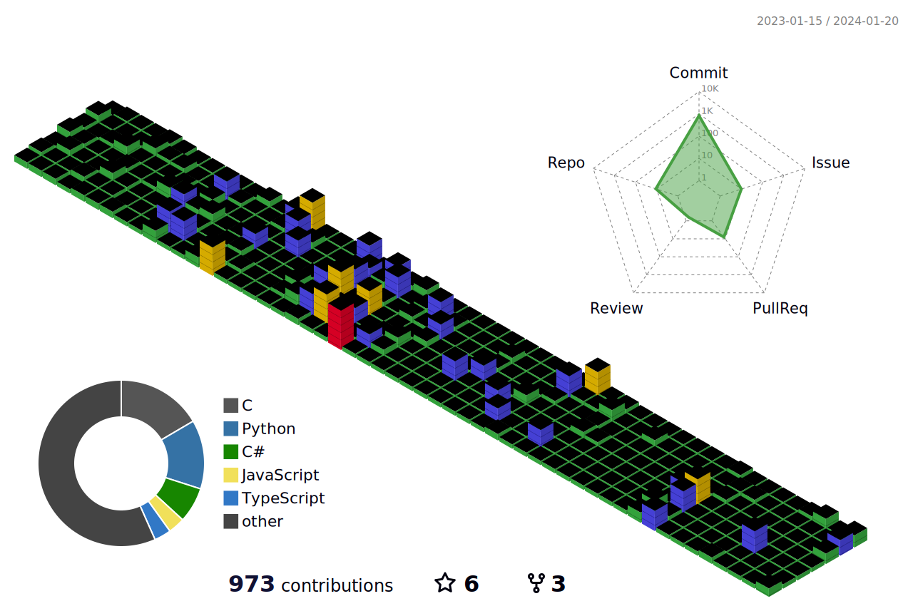

### ByeoungHun Hwang     
 
 <!-- 노션,블로그,인스타 -->
  
<!-- 방문자,백준 -->
  
  

   
<!-- 깃헙 Stats -->
<h2>:octocat: My GitHub Stats </h2>

📊 General Stats

 
 

 
 🧬 3D Stats

 
 

💼 Top languages

  
 

 
 

 

 :fire: Streak stats

    

 📈Contribution Graph

 
🏆 Achievements

 

 

## 🛠 Tools I use 
<code></code>
<code></code>
<code></code>
<code></code>
<code></code>
<code></code>
<code></code>
<code></code>
<code></code>
<code></code>
<code></code>
  
##  💡 Languages & Frameworks   

<code></code>
<code></code>
<code></code>
<code></code>
<code></code> 
<code></code>
   
## 📚 Learning

<code></code>
<code></code>
<code></code>
<code></code>
<code></code>
<code></code>
<code></code>
          
  

## ⚡️ DEMO REPO 

<!-- [Java_Practice_2022](https://github.com/HwangBBang/JAVA_Practice_2022)  
[Python_Practice_2022](https://github.com/HwangBBang/Python_Practice_2022)  
[Mini_Project](https://github.com/HwangBBang/Mini_Project)  
[Team-KKLHY](https://github.com/HwangBBang/team-KKLHY)  
[BaekJoon](https://github.com/HwangBBang/BaekJoon)  
[Html_Practice_2022](https://github.com/HwangBBang/HTML_Practice_2022) -->
  
## :snake: Snake that eats mine 

 

  
 
---

### 🔥 Strength
  
🚧 공사중 🚧
 
 

 

 
 
 
