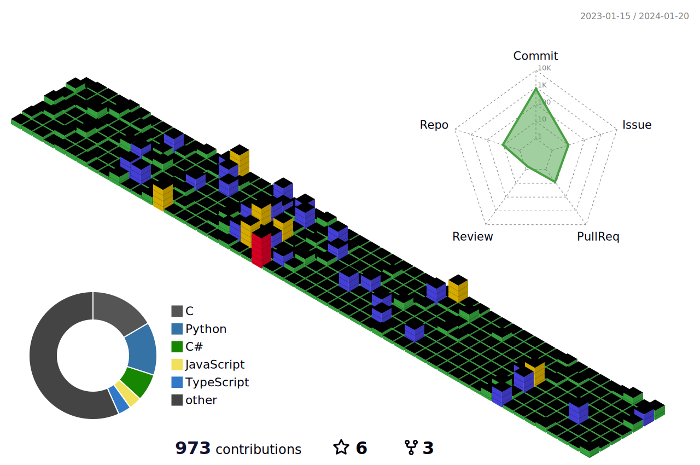

### Byunghun Hwang    
 <!-- 노션,블로그,벨로그 -->
 <!--
 

 
 
 

 

-->
 

<!-- 방문자,백준 -->
 
 

 

# 🃏 Current activity

- 마이다스 IT | BE개발 (2026.02 ~ 현재)
    
- [한국외대 공간 예약 서비스](https://studyroom.computer.hufs.ac.kr/) | PO, BE개발 (2024.02 ~ 현재)
  + 한국 외국어 대학교 컴퓨터 공학과 학부생들을 위한 공간 예약 상용 서비스
  + DB 설계, RESTFul API Server 개발, CI 환경 구축, 운영

- [SiliconBridge.Inc](https://www.eyevacs.com/) | 정규직, BE개발 (2024.12 ~ 2025.05)
  + 아파트 주차 관제 서비스 
  + RESTFul API Server 개발, 유지보수 및 비용 최적화, QA, DX 개선 
 
- [ITS.edu](https://github.com/hexagon-talent/its-service) | PO, BE개발 (2024.07 ~ 2024.11)
  + 국제 무역사 학습 서비스
  + 기획, DB 설계, RESTFul API Server 개발, CI/CD 환경 구축 
    

<!-- 깃헙 Stats -->

<h2>💬 About Me </h2>

 
💫 Experience

   

    
  - [(24.06) 2024-1 HUFS Capstone Design and Lab / Real-Time Inspection Imaging App](https://github.com/user-attachments/assets/f984fc40-44a1-40a9-b841-6bc3fc683b20)
  - [(23.08) Participated in a Venture Start-up Hackathon](https://github.com/kimjisub/event-form)
  - [(23.07 ~ 23.08) Organized, planned and led a C/C++ study group.](https://brash-partner-0d2.notion.site/Ids-Lab-Cpp-Study-d24280ac40cc4aaca4082666720b5f9c?pvs=4)
  - [(23.06) Participated in a 2023 HUFSummer Hackathon](https://github.com/kimjisub/careero)
  - (23.04 ~ ) Private Tutoring Activities as a Python and Algorithm Instructor.
  - [(23.03 ~ 23.12) HUFS Intelligent Database System Lab. Undergraduate student.](http://ids.hufs.ac.kr/)
  - (22.12 ~ 23.05) The Coding club. Tutoring Activities as a C, Python Instructor.
  - [(22.11) [4th HUFS Code Festival] Beginner Track TOP-7](https://hufs.goorm.io/learn/lecture/34043/%EC%A0%9C-4%ED%9A%8C-hufs-code-festival-beginner-track/exam)
  - [(22.07 ~ 22.09) Organized, planned and led a JavaScript study group.](https://github.com/HwangBBang/JS-study)
   

 
🏆 Achievements

 

  
  - [_2022 HUFS Code Festival - Beginner Track TOP-7_](https://hufs.goorm.io/learn/lecture/34043/%EC%A0%9C-4%ED%9A%8C-hufs-code-festival-beginner-track/exam)
  
  - [_2023 HUFSummer Hackathon 한국외국어대학교 총장상(대상) 수상_](https://github.com/HwangBBang/careero)

  - [_2024-1 HUFS 캡스톤 설계 및 실습 / 실시간 검품 이미지 촬영 앱  - 최우수팀 선정 (Team lead)_](https://github.com/user-attachments/assets/f984fc40-44a1-40a9-b841-6bc3fc683b20)

 
 

📊 Top languages

 
  

  
  

  

 
 
 

:octocat: GitHub Stats

 
  

  
  

</a>
  

  
 

 

 📈Contribution Graph
  
 
    

 

 

 🏅 BOJ Stats

 
    
  
   
   
 
 

<!--

 
 🧬 3D Stats

 

-->

 

## 🛠 Tools I use 

<code></code>
<code></code>
           
<code></code>
<code></code>
<code></code>
<code></code>
<code></code>
           
<code></code>
<code></code>

<code></code>
<!--
<code></code>
<code></code>
<code></code>
<code></code>
<code></code>
<code></code>
<code></code>
<code></code>
<code></code>
<code></code>
<code></code>
<code></code>
--> 
  
##  💡 Languages & Frameworks   

<code> </code>
<code></code>
<code></code>
<code></code>  
<code></code>
<code></code>
           
  
##  🗂️ DB
<code></code>
<code></code>
<code></code>
<code></code>

  
           
<!--
## 📚 Learning
<code></code>
<code></code>
<code></code>
<code></code>
<code></code>
<code></code>
<code></code>           

<!--
## 📑 What i've done

<code></code> 
<code></code>
<code></code>
  
-->

<!-- 
## ⚡️ DEMO REPO 

[Java_Practice_2022](https://github.com/HwangBBang/JAVA_Practice_2022)  
[Python_Practice_2022](https://github.com/HwangBBang/Python_Practice_2022)  
[Mini_Project](https://github.com/HwangBBang/Mini_Project)  
[Team-KKLHY](https://github.com/HwangBBang/team-KKLHY)  
[BaekJoon](https://github.com/HwangBBang/BaekJoon)  
[Html_Practice_2022](https://github.com/HwangBBang/HTML_Practice_2022) -->

## 🐍 GitHub Snake Animation

<picture>
  <source media="(prefers-color-scheme: dark)" srcset="https://github.com/HwangBBang/HwangBBang/blob/output/github-snake-dark.svg" />
  <source media="(prefers-color-scheme: light)" srcset="https://github.com/HwangBBang/HwangBBang/blob/output/github-snake.svg" />
  
</picture>

  

---

### 🔥 A field of Interest
  
- Spring Framework
- Programming language Education
 
 

 

 
 
 
 

